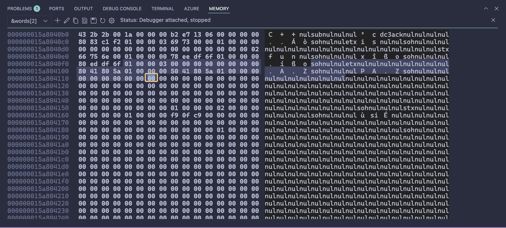
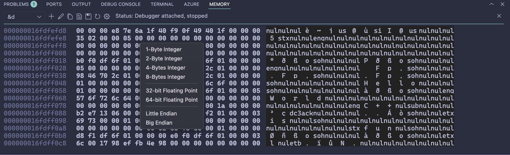
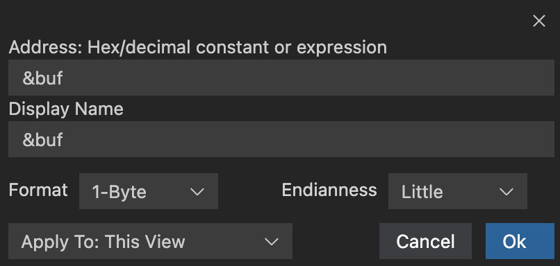

# MemoryView Extension Overview

The MemoryView extension was originally conceived as part of the Cortex-Debug extension. Then it was [developed](https://github.com/mcu-debug/memview) as a stand-alone extension so it could be useful for other debuggers. I forked the repository and added support for other C/C++ debuggers, along with more functionality, to the MemoryView.

You can find it on the Visual Studio Marketplace: [MemoryView](https://marketplace.visualstudio.com/items?itemName=Debugger.memoryview). Please read the following first:

This is a memory viewer extension specially designed to work with debuggers. It can be used with any debugger that supports memory reads (and optional writes). Currently, `cppvsdbg`, `cppdbg`, `lldb-dap`, `cortex-debug`, and `cspy` are the supported debuggers. This extension is particularly suitable for low-level, mid-level, or embedded developers. The debugger must support the [Debug Adapter Protocol](https://microsoft.github.io/debug-adapter-protocol/).



VSCode provides a mechanism to launch a memory visualizer for certain types of items in Variables and Watch. Generally, most C/C++ debuggers provide a memory reference for pointers. By default, VSCode uses its own `HexEditor`. If you hover over items that are pointers, you will see a special button to launch the `HexEditor`. There is no user setting to change which editor/visualizer to use; it is hardcoded in the VSCode platform. We are working on a change to support this in a limited scope by replacing the `HexEditor` with the `MemoryView` extension (coming soon...).

---

## Features

This extension was originally part of the [Cortex-Debug](https://github.com/Marus/cortex-debug) extension, but it was later made stand-alone to benefit other debuggers.

-   **Infinite scrolling**: Currently, artificially limited to 4MB (this limit may change).
    -   Very little data is fetched initially, with more loaded as you scroll.
-   **Multiple data views**: Supports 1/2/4/8-byte integers and 4/8-byte floats. Decoded bytes are only shown in 1-byte mode. Saving to clipboard/files always uses 1-byte mode.
-   **Persistent views**: Survive across multiple debug sessions and VSCode restarts.
-   **Single-panel hosting**: A deliberate design choice to house multiple views in one panel for ease of use.
    -   Note: Separate views can interfere with debugging performance due to excessive traffic during single-stepping.
-   **Quick memory copying**: One-click to copy memory addresses from the address panel.
-   **Upcoming features**:
    -   Paste functionality (selection and copy to clipboard are already available).
    -   Memory editing with the capability to commit changes to program memory.
    -   Option to host the window in either the 'Panel' area (alongside Debug Console) or the editor area.
    -   The ability to launch the memory viewer from within the Variables/Watch windows (requires cooperation from the VSCode team, but workarounds are in progress).

#### Right-click the context menu to switch between views :<br/>



#### Below are the available customizations for a memory view:<br/>



---

## Usage (Manually within VSCode)

1. Use the Command Palette and select `MemoryView: Add new memory view...` while a debug session is paused.
2. Enter an address or a C-style expression that the debugger can interpret (e.g., GDB) to return an address. Expressions should use global variables to ensure proper functionality during view refreshes.
3. Once successfully attached, a `MEMORY` tab will appear in the Panel area.
4. Memory requests are aligned to a 16-byte boundary. Data is fetched and rendered in 512-byte chunks as needed (subject to future changes).

**Note**: Editing features are not yet available. You can make edits, but they won’t be saved to your program.

Memory views are preserved across VSCode restarts and stored on a per-workspace basis. There are three states for memory views:

-   **Orphaned**: Not connected to a debugger. Displays the last seen values (if available). When a new debug session starts with a supported debugger, orphaned views attempt to reattach automatically, with an indicator shown in the toolbar.
-   **Busy**: Attached to the debugger, but the program is running. Updates to memory views cannot occur in this state. Although it is technically possible to read memory while running, most GDB-based debuggers do not support this.
-   **Paused**: The program is paused, allowing memory updates. Visible areas refresh automatically, with additional data fetched as required. Any previous data changes are marked for reference.

---

## Usage (Manually from a Browser)

Enter a URL in the format `vscode://mch-debug.memoryview/ADDRESS-OR-EXPRESSION` to open a new view (best done when the debugger is paused). For example:
`vscode://Debugger.memoryview/0x20000670`
This will open a view for address `0x20000670`. All previously mentioned options apply here as well.

---

## Usage (Programmatically by Another Extension)

-   We plan to provide an API for other extensions, which will be implemented as soon as required.
-   Any extension can create a memory view using the VSCode API to open a URI. The first extension to use it will likely be Cortex-Debug.
-   Please avoid using this in production until the API is finalized. Feel free to experiment.

---

```typescript
const options: MemviewUriOptions = {
    expr: '&buf'
};
const uri = vscode.Uri.from({
    scheme: vscode.env.uriScheme,
    authority: 'Debugger.memoryview',
    path: '/' + encodeURIComponent('&buf'), // Use any expression or hex or decimal constant here
    query: querystring.stringify(options as any)
});
vscode.env.openExternal(uri).then((success: boolean) => {
    // Of course you would not be using console.log, but you get the point
    // One problem right now is that it always seems to succeed even when a view did
    // not start successfully. Please let us know of issues and we will figure it out
    console.log(`Operation URI open: success=${success}`);
}),
    (e: any) => {
        console.error(e);
    };
```

The interface for options is as follows

```typescript
/**
 * Proposed API
 *
 * It is best to add a new memory view when a debug session is active and in stopped
 * status. Otherwise, there has to be a lot of guessing and we may not always get it right
 * or get it right immediately.
 *
 * Note that once we match a memory view with a debug session, we start tracking it for
 * future invocations and automatically bind to a new session. Of course, this can fail
 * if the session name changes or workspace folder changes.
 */
export interface MemviewUriOptions {
    /**
     * `memoryReference` is what a debug adapter provides. It is an opaque string representing a location in memory.
     * If this exists, we use it if the there is no `expr`, or if you have an `expr` as a fallback memory location.
     * This is generally provided by automated tools and not something to be manually entered.
     */
    memoryReference?: string;

    /**
     * `expr` can be a constant memory address or an expression resulting in an address by debugger using evaluate().
     * URI path is used if no expr is specified
     */
    expr?: string;

    /**
     * We try to derive most of the following if not specified. If sessionId is specified, it should
     * be a currently running debugger (may not be active session). When we can't match the active
     * debug session with what the sessionId given, we may defer to until later.
     */
    sessionId?: string | 'current'; // Undefined also means 'current' if there is an active session

    /** If not supplied, use `expr` or `memoryReference` or the URI path */
    displayName?: string;

    /**
     * Following two can be used for better matching of an inactive memory view with a later active
     * debug session. Unfortunately, that only works when the debugger starts a new session
     */

    /** Session name for better matching with a future debug session. */
    sessionName?: string;

    /** Workspace folder associated with the debug session for better matching with a future debug session. */
    wsFolder?: string; // Must be a Uri.toString() of an actual wsFolder for the session
}
```

There is also a command you can be used to add a new memory view. This may be safer in remote environments where vscode.env.openExternal can potentially fail. We have defined a command as follows

```typescript
    vscode.commands.registerCommand('Debugger.memoryview.addMemoryView', (constOrExprOrMemRef?: string, opts?: MemviewUriOptions);
```

If no arguments are given, user will be promoted for an expression. This command will do the same thing as what a Uri Handler does but maybe easier to use. We ourselves are going to use this method -- which can fail if the Memory View is not yet installed.

There are a few challenges here `memview` is not built into a debugger and thus does not know the exact status. It does its best to track existing debug sessions -- note that there can be multiple debug sessions going on concurrently and they can be in various stages.
